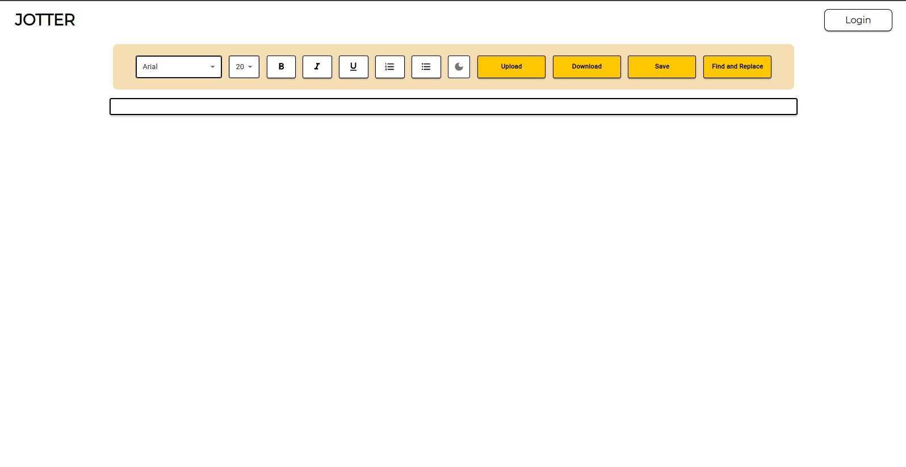
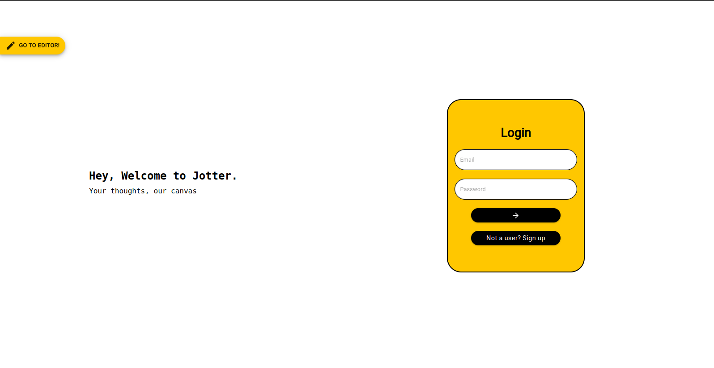
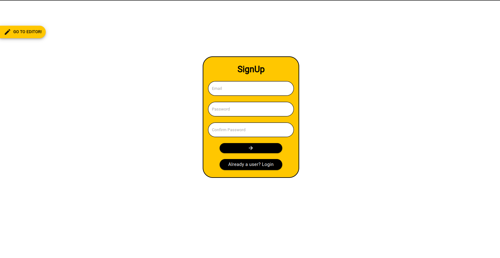
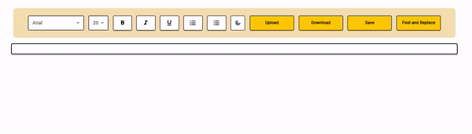

# Jotter
A simple web-based text editor with basic functionalities for the course CS455

## Repository Design
The repository will have two major sub-folders;
- Jotter-Frontend
- Jotter-Backend

### Jotter-Frontend 

1. #### Folder Structure
    This folder contains all the frontend code for the project. The frontend is developed using NextJS under the yarn package manager.

    - We have all the pages in the `pages` folder. It consists of the home page ( the main text editor ), the login page and the signup page.

    - The `components` folder will contain all the components that will be used in the pages. It consists  of the config files for color theme and backend URL, components like text-editor, input, button, layout, animation stuff, etc.
    - The `public` folder will contain all the static files like images, etc. 
    - The `styles` folder will contain all the stylesheets for the project. These are used to apply global styles or specific styles to a component. However we have used inline styles more than the stylesheet.

2. #### UI
    - **Home Page**   
    

    
    

    - **Login Page**   
    

    
    

    - **Signup Page**   
    

    
    

3. #### Demonstration
    - **Formatting**  
    

    
    

    - **Font size and style**   
    

    
    

4. #### Testing
    Testing is done using Jest and React Testing Library. The tests are written in the `__tests__` folder. The tests are run using the command `yarn test`.

5. #### Deployment
    The frontend is deployed on Vercel and the link is [https://jotter-one.vercel.app/](https://jotter-one.vercel.app/).

### Jotter-Backend 

1. #### Folder Structure
    This folder contains all the backend code for the project. The backend is developed using fastAPI in Python.
    - `alembic` folder contains scripts to manage database migrations and management.
    - `app` folder contains the subfolders and scripts to initialize server, database connections and other helpers.
    - `app/routers` contain the API endpoint handler functions.
    - `app/tests` folder contains all the unit tests for all APIs and edge cases.
2. #### APIs
    - `POST /login` API lets a user authenticate their emailID and password and provides authorization token with a certain TTL.
    - `POST /users` API lets a user register themselves providing a valid emailID and password.
    - `PUT /users/save` API lets an authenticated user with valid token save their work as a string in the database.
    - `GET /users` API lets an authenticated user with vaild token to retrieve their saved work anytime.
3. #### Testing
    To run the tests for backend, use `make test` from base directory. It will display the number testcases Failed/Passed.
4. #### Deployment
    The backend is deployed on Vercel and the link is  [jotter-backend.vercel.app](https://jotter-backend.vercel.app/).
    

## Issues and Tasks
The issues for each are created in the issues tab. Each issue has a priority assigned to itself and is part of a milestone defined in the milestones tab.

The priorities are either of these three types:
- `low priority`
- `medium priority`
- `high priority`

Each issue has a estimate of number of working days written in the description.

Each milestone has a due-date which accomodates all the estimates of the underlying issues in that particular milestone.

These issue will be assigned to the members and pull requests will be created over the same issues accordingly in due course of time.
